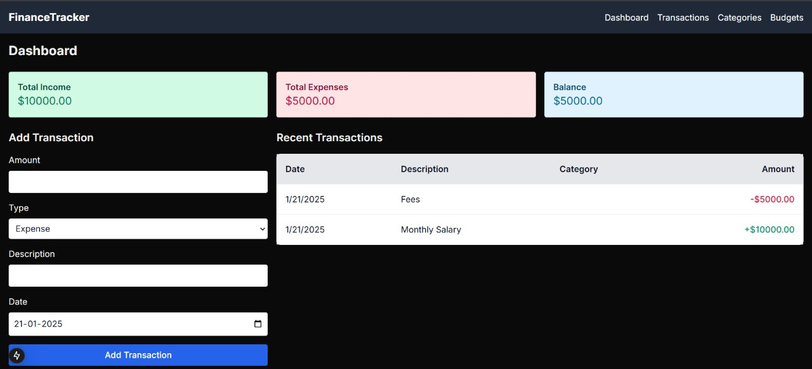

# Finance Tracker



A modern web application for tracking personal finances, built with Next.js and TypeScript.

## Features
- 📊 Real-time financial dashboard
- 💰 Track income and expenses
- 📝 Transaction history
- 📱 Responsive design

## Tech Stack
- Next.js with TypeScript
- React Query for data fetching
- Tailwind CSS for styling

## Getting Started
1. Clone the repository
2. Install dependencies:
    ```bash
    npm i
    ```
3. Start the development server:
    ```bash
    npm run dev
    ```
    The application will be available at http://localhost:3000